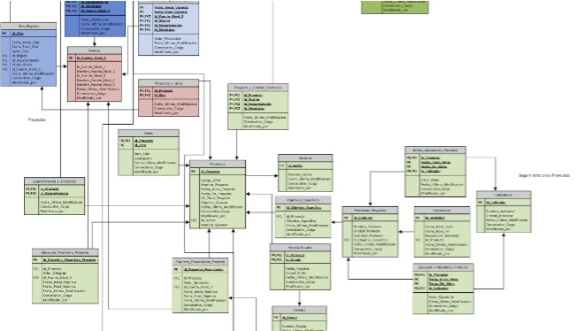

Title: No more ER diagrams please!
Date: 2013-03-12 10:20
Slug: no-more-erd
Category: tech, db
<!-- Tags: thats, awesome
Slug: my-super-post
Author: Alexis Metaireau
Summary: Short version for index and feeds -->

Having been working with other developing companies in Bogotá, one of the worst practices I've seen is using the ERD as the *first* and sometimes only  

## What's an Entity Relationship Diagram?

From wikipedia:

> An ER model is an abstract way to describe a database. Describing a database usually starts with a relational database, which stores data in tables. Some of the data in these tables point to data in other tables - for instance, your entry in the database could point to several entries for each of the phone numbers that are yours. 

They kinda look like: 

.

(This is an actual example from a government project we worked on last year.)

## How before why

To me, 
